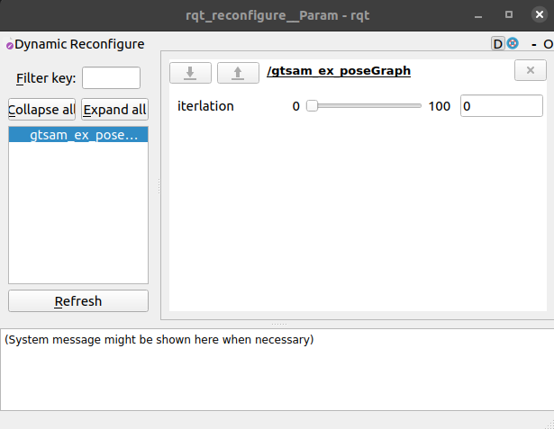
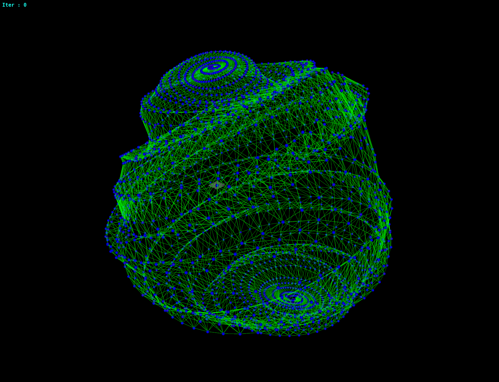
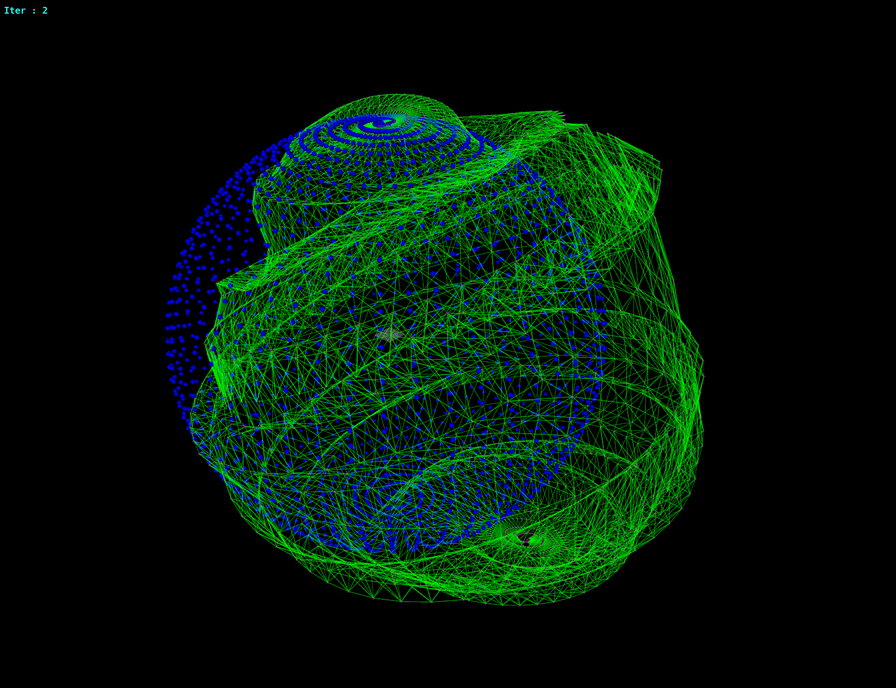
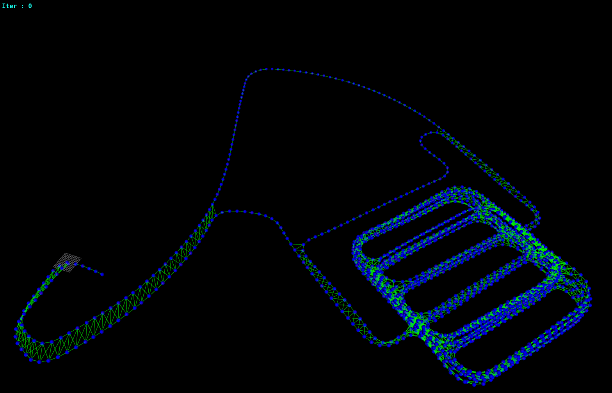
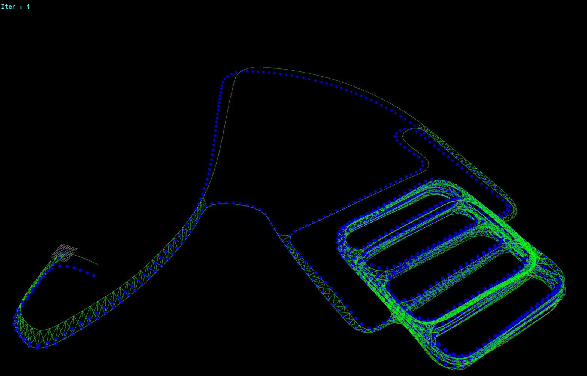

# gtsamEx

## Nonlinear factor graph optimization visualizer

* Optimization .g2o and control to iterlation in dynamic_reconfigure

## Dependency
* ROS (tested in __Noetic__ only)
```
sudo apt-get install ros-noetic-jsk-visualization
```

* gtsam
```
sudo apt-get install ros-noetic-gtsam
```

## Install
Use the following commands to download and compile the package.

```
cd ~/catkin_ws/src
git  clone https://github.com/aksrb1030/gtsamEx
cd ..
catkin_make
```

## Visualizer

### dynamic_reconfigure


### sphere.g2o(before)


### sphere.g2o(after)


### parking-garage_after.g2o(before)


### parking-garage_after.g2o(after)
